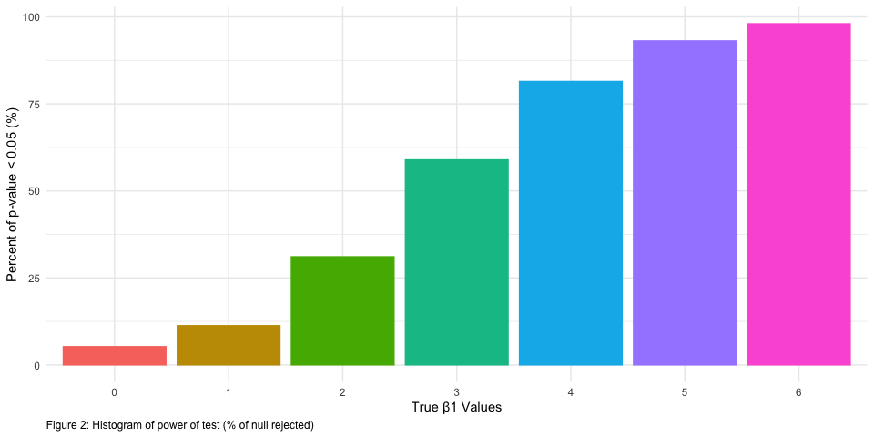
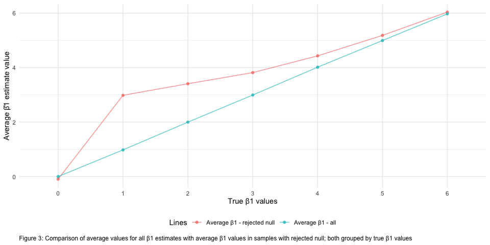

P8105 Data Science I - Homework 5
================
Kevin S.W. UNI: ksw2137
10/31/2019

# Problem 1

Dataframe setup using the codes given by the class.

``` r
# load tidyverse (although already loaded prior)
library(tidyverse)                                   

# setting seed for reproducibility
set.seed(10)

# loads native data in R and applies NA randomly
iris_with_missing = iris %>% 
  map_df(~replace(.x, sample(1:150, 20), NA)) %>%
  mutate(Species = as.character(Species))
```

It is a 150 x 5 matrix with 100 `NA`; 20 per column. After setting this
up, below we have a function that modifies a vector by:

  - Filling missing numeric variables with the mean of non-missing
    values within the column
  - Filling missing character variables with character of choice
    (defaults “virginica”)

<!-- end list -->

``` r
# replace numeric with average, character with input of choice
avgchar_na_replace <- function(input_vec, char_replace = "virginica") { # function that takes in df and char input 
  if (!is.numeric(input_vec) & !is.character(input_vec)) {              # quick check if input = char/numeric
    stop("Argument should only be numeric or character vector")         # error message
  } else if (is.character(input_vec)) {                                 # if character, replace with char input
    replace_na(input_vec, char_replace)
  } else if (is.numeric(input_vec)) {                                   # if numeric, return a mean of the vector
    round(replace_na(input_vec, mean(input_vec, na.rm = TRUE)), 1)      # with 1 decimal
  }
}

new_iris <-                                                             # a dataframe that stores the results
  map2(.x = iris_with_missing,                                          # map function that utilizes function above
       .y = "virginica", 
       ~avgchar_na_replace(input_vec = .x, char_replace = .y)) %>% 
  as_tibble()
```

The `new_iris` variable stores new dataframe after applying
`avgchar_na_replace` function with `purrr::map2` (`.x` for dataframe and
`.y` for character input). If a column is numeric, it will automatically
input average of column. Example: 5.8, which is the average of available
numbers in `Sepal.Length` column, replaces `NA` in that column.
`skimr::skim(new_iris)` reveals no missing variables.

# Problem 2

We have 20 files that contains 8-weeks longitudinal study result files
for 10 subjects under experiment and control arm. First, we need to
consolidate this into 1
dataframe.

### Reading and Cleaning Data

``` r
exp_df <- list.files("./data") %>%                                # makes a list of filenames under data folder
  tibble::enframe(name = NULL) %>%                                # turns list into a row x 1 column tibble
  rename("file_name" = value) %>%                                 # rename column
  mutate(                                                         # maps read_csv to iterate based on "filenames"
    weekly_data = map(file_name, ~read_csv(str_c("./data/", .x))) # stores read data as listcol 
  ) %>% 
  unnest()                                                        # unnest data to expand listcol into tibble 
```

Now that we have our dataframe, we need to clean it up.

``` r
# cleaning the tibble
clean_exp_df <- exp_df %>% 
  janitor::clean_names() %>% 
  separate(col = file_name,                                                     # separate the file name
           into = c("group", "subj_id"), "_") %>% 
  pivot_longer(week_1:week_8,                                                   # turn into long form
               names_to = "week",
               values_to = "observation",
               names_prefix = "week_") %>%                                      # remove common character
  mutate(
    subj_id = as_factor(as.numeric(str_replace(subj_id, "\\.csv", ""))),        # remove file extension, factorize
    group = as_factor(recode(group, "con" = "Control", "exp" = "Experiment")),  # rename group variable, factorize
    week = as_factor(week)                                                      # factorize
    )  
```

Our clean dataframe is a 160 x 4 matrix with 4 variables; `group`
(control/experiment), `subj_id` (subject “number”), `week` (week 1, 2,…,
8), and `observation` (recorded data).

### Plotting Differences in Experimental vs Control Group

Now that it’s tidied, we could start exploring patterns and such. Below
is a spaghetti plot that traces the data based on their group.

``` r
# spaghetti plot of each subject by control/experiment
# requires plotting twice to separate control/experiment
clean_exp_df %>% 
  filter(group == "Control") %>% 
  ggplot() +                                                                   # plot for control group
  geom_point(aes(x = week, y = observation, color = group),                    # point plot for control group  
             size = 2.5, alpha = 0.6) +
  geom_line(aes(x = week, y = observation, group = subj_id, color = group),    # line color by group
            size = 0.8, alpha = 0.6) +
  
  # another set of geom_point/_line for control group. Alpha is differentiated to aid discernment
  geom_point(data = clean_exp_df %>%                                           # point plot for experiment group 
               filter(group == "Experiment"),
             aes(x = week, y = observation, color = group), 
             size = 2.5, alpha = 0.5) +
  geom_line(data = clean_exp_df %>%                                            # line color by group
              filter(group == "Experiment"), 
            aes(x = week, y = observation, group = subj_id, color = group), 
            size = 0.8, alpha = 0.5) +
  labs(x = "Week Number",
       y = "Observed Measurement",
       caption = "Figure 1: Spaghetti plot of 10 subjects over 8 weeks under experimental and control group",
       color = "Group"
       )
```


Per above, experiment group’s observed data increases as the week goes
by for all subjects while control stays relatively flat. This suggests
treatment in experimental group have a positive correlation. Next step
is testing if difference between groups is statistically significant or
not.

# Problem 3

### Obtaining Simulation Data

In this problem, we are going to be trying our hands on some simple
linear regression simulation, which has a general formula of:
\[y_i=\beta_0 + \beta_1\cdot x_{i1} + \epsilon_i\]

We will be running the simulation under several assumptions:

  - \(n = 30\)
  - \(\beta_0 = 2\)
  - \(x_i\sim N(0,1)\)
  - \(\sigma^2 = 50\)

We will then vary our “true” slope, \(\beta_1=\{0, 1, 2, 3, 4, 5, 6 \}\)

``` r
# general simple linear regression simulation function...
slr_sim <- function(n, beta0 = 2, beta1, var) {  # function with beta0 default = 2
  
  sim_data = tibble(
    x = rnorm(n, mean = 0, sd = 1),                         # x pulled from standard normal distro
    y = beta0 + beta1 * x + rnorm(n, 0, sqrt(var))
  )
  
  ls_fit = lm(y ~ x, data = sim_data) %>%                   # linear model fit
    broom::tidy()                                           # turns into tibble; easier to obtain b1_hat, p-val
  
  tibble(                                                   # puts specified values inside a new tibble
    beta1_hat = ls_fit[[2,2]],                              # beta1_estimate
    p_val = ls_fit[[2,5]]                                   # p-value for testing H_o: beta1 = 0
  )
}

# code to run 10,000 simulations per beta1 of 1-6 and obtain beta1_hat and p-value
beta_value_df <- tibble(
  beta1_values = 0:6) %>%                                         # make a column of our "true" beta1 values
  mutate(                                                         # apply our beta1 to the linear regression fn
    testruns =                                                    # adds a listcol to column "testrun"
      map(beta1_values,                                           # run simulation 10k / beta1 value
          ~rerun(10000, slr_sim(n = 30, beta1 = .x, var = 50)))   # fixed values of n, variance 
  ) %>% 
  unnest() %>%                                                    # unnests the 10k observations
  unnest()                                                        # unnests the beta1_hat and p-val inside each obs
```

Our resulting dataframe contains 70000 rows which correspond to 10,000
observations per \(\beta_1\). It has 3, which stores the true `beta1`,
`beta1_hat`, and `p_val`. Now that we’ve obtained our datapoints for
each \(\beta_1=\{0, 1, 2, 3, 4, 5, 6 \}\), we can plot and see the
relationship of the estimated \(\hat\beta_1\) against the true
\(\beta_1\).

### Relationship between Effect Size and Power

First, we’ll graph the proportion of \(p-value < 0.05\), which indicates
the power of the test.

``` r
beta_value_df %>% 
  group_by(beta1_values) %>% 
  summarize(null_reject = sum(p_val < 0.05),
            total_obs = n()) %>% 
  mutate(
    rate_reject = (null_reject/total_obs) * 100,
    beta1_values = as_factor(beta1_values)
  ) %>% 
  ggplot(aes(x = beta1_values, y = rate_reject, color = beta1_values, fill = beta1_values)) +
  geom_bar(stat = "identity") +
  labs(x = "True β1 Values",
       y = "Percent of p-value < 0.05 (%)",
       caption = "Figure 2: Histogram of power of test (% of null rejected)"
       ) +
  theme(legend.position = "none")
```



Per above, we see that as effect size rises, power of the test
increases. This aligns with our understanding of effect size and power
of the test. If we think of effect size as the distance between two
curves’ center, then it makes sense that our power increases as this
distance
increases.

### Average Estimates of \(\hat\beta_1\) vs True \(\beta_1\) in Two Situations

We could also plot the overall average estimates of \(\hat\beta_1\)
compared against the true \(\beta_1\) and overlay the average estimate
for \(\hat\beta_1\) from samples with rejected null.

``` r
rejected_avg_beta <- beta_value_df %>% 
  filter(p_val < 0.05) %>%
  group_by(beta1_values) %>% 
  summarize(mean_beta_reject = mean(beta1_hat)) %>% 
  mutate(beta1_values = as_factor(beta1_values))

total_avg_beta <- beta_value_df %>% 
  group_by(beta1_values) %>% 
  summarize(mean_beta1_hat = mean(beta1_hat)) %>% 
  mutate(beta1_values = as_factor(beta1_values))
  

left_join(rejected_avg_beta, total_avg_beta, by = "beta1_values") %>% 
  pivot_longer(mean_beta_reject:mean_beta1_hat,
               names_to = "betahat",
               values_to = "mean_value") %>% 
  ggplot(aes(x = beta1_values, y = mean_value, color = betahat)) +
  geom_point(aes(group = betahat), alpha = 0.7) +
  geom_line(aes(group = betahat), alpha = 0.7) +
  labs(x = "True β1 Values",
       y = "Average β̂1 p-value < 0.05 (%)",
       caption = "Comparison of average values for all β1 estimates with average β1 values in samples with rejected null; both grouped by true β1 values"
       ) +
  scale_color_discrete(name = "Lines", labels = c("Average β1 - rejected null", "Average β1 - all"))
```


