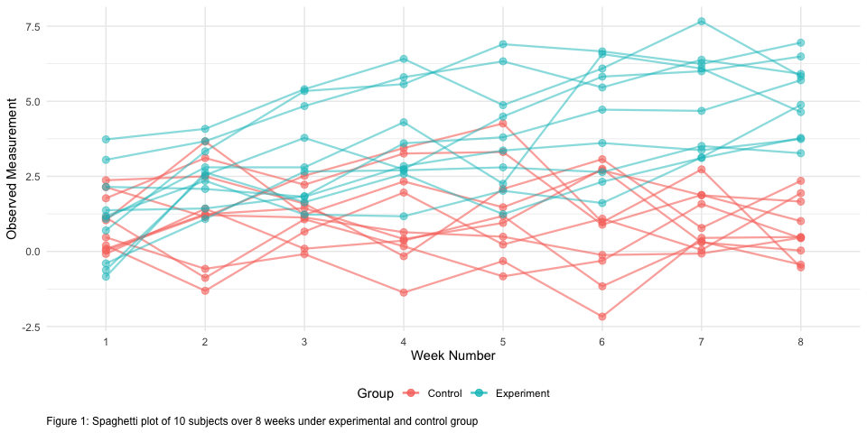

P8105 Data Science I - Homework 5
================
Kevin S.W. UNI: ksw2137
10/31/2019

# Problem 1

Dataframe setup using the codes given by the class.

``` r
# load tidyverse (although already loaded prior)
library(tidyverse)                                   

# setting seed for reproducibility
set.seed(10)

# loads native data in R and applies NA randomly
iris_with_missing = iris %>% 
  map_df(~replace(.x, sample(1:150, 20), NA)) %>%
  mutate(Species = as.character(Species))
```

It is a 150 x 5 matrix with 100 `NA`; 20 per column. After setting this
up, below we have a function that modifies a vector by:

  - Filling missing numeric variables with the mean of non-missing
    values within the column
  - Filling missing character variables with character of choice
    (defaults “virginica”)

<!-- end list -->

``` r
# replace numeric with average, character with input of choice
avgchar_na_replace <- function(input_vec, char_replace = "virginica") { # function that takes in df and char input 
  if (!is.numeric(input_vec) & !is.character(input_vec)) {              # quick check if input = char/numeric
    stop("Argument should only be numeric or character vector")         # error message
  } else if (is.character(input_vec)) {                                 # if character, replace with char input
    replace_na(input_vec, char_replace)
  } else if (is.numeric(input_vec)) {                                   # if numeric, return a mean of the vector
    round(
      replace_na(                                                       # with 1 decimal
        input_vec, mean(input_vec, na.rm = TRUE)), 1)
  }
}

new_iris <-                                                             # a dataframe that stores the results
  map2(.x = iris_with_missing,                                          # map function that utilizes function above
       .y = "virginica", 
       ~avgchar_na_replace(input_vec = .x, char_replace = .y)) %>% 
  as_tibble()
```

The `new_iris` variable stores new dataframe after applying
`avgchar_na_replace` function with `purrr::map2` (`.x` for dataframe and
`.y` for character input). If a column is numeric, it will automatically
input average of column. Example: 5.8, which is the average of available
numbers in `Sepal.Length` column, replaces `NA` in that column.
`skimr::skim(new_iris)` reveals no missing variables.

# Problem 2

We have 20 files that contains 8-weeks longitudinal study result files
for 10 subjects under experiment and control arm. First, we need to
consolidate this into 1 dataframe.

``` r
# stores file names inside specified path and turn it into r x 1 tibble
files <- list.files("./data") %>% 
  tibble::enframe(name = NULL) %>%
  rename("file_name" = value)

# maps read_csv to iterate reading all the files based on files above
# and make a listcol out of the read contents, then unnested to get a proper tibble
exp_df <- files %>% 
  mutate(
    weekly_data = map(file_name, ~read_csv(str_c("./data/", .x)))
  ) %>% 
  unnest()
```

Now that we have our dataframe, we need to clean it up.

``` r
# cleaning the tibble
clean_exp_df <- exp_df %>% 
  janitor::clean_names() %>% 
  separate(col = file_name,                                                     # separate the file name
           into = c("group", "subj_id"), "_") %>% 
  pivot_longer(week_1:week_8,                                                   # turn into long form
               names_to = "week",
               values_to = "observation",
               names_prefix = "week_") %>%                                      # remove common character
  mutate(
    subj_id = as_factor(as.numeric(str_replace(subj_id, "\\.csv", ""))),        # remove file extension, factorize
    group = as_factor(recode(group, "con" = "Control", "exp" = "Experiment")),  # rename group variable, factorize
    week = as_factor(week)                                                      # factorize
    )  
```

Our clean dataframe is a 160 x 4 matrix with 4 variables; `group`
(control/experiment), `subj_id` (subject “number”), `week` (week 1, 2,…,
8), and `observation` (recorded data).

Now that it’s tidied, we could start exploring patterns and such. Below
is a spaghetti plot that traces the data based on subject and their
group.

``` r
# spaghetti plot of each subject by control/experiment
# requires plotting twice to separate control/experiment

ggplot(clean_exp_df %>%                                                        # plot for experiment group
         filter(group == "Experiment")) +
  geom_point(aes(x = week, y = observation, shape = group),                    # point plot for experiment
             size = 2.5, alpha = 0.8) +
  geom_line(aes(x = week, y = observation, color = subj_id, group = subj_id),  # line color by subject
            size = 0.8, alpha = 0.8) +
  
  # another set of geom_point/_line for control group. Alpha is differentiated to aid discernment
  geom_point(data = clean_exp_df %>%                                           # point plot for control 
               filter(group == "Control"),
             aes(x = week, y = observation, shape = group), 
             size = 2.5, alpha = 0.5) +
  geom_line(data = clean_exp_df %>%                                            # line color by subject
              filter(group == "Control"), 
            aes(x = week, y = observation, color = subj_id, group = subj_id), 
            size = 0.8, alpha = 0.5) +
  guides(color = guide_legend(override.aes = list(size = 5))) + # resize the color code for legends
  labs(x = "Week",
       y = "Observed Measurement",
       caption = "Figure 1: Spaghetti plot of 10 subjects over 8 weeks under experimental and control group",
       color = "Subject ID",
       shape = "Group"
       ) +
  theme(legend.position = "right")
```



As we can see above however, this plot is very messy because there are
too many subjects in the plot; even adding shapes doesn’t help too much.
For greater clarity, we could facet this below

``` r
# better "spaghetti" plot
clean_exp_df %>%                                                # base for facet graph
  ggplot(aes(x = week, y = observation, color = subj_id)) +     # give color by subjects
  geom_point(size = 2) + 
  geom_line(aes(group = subj_id), alpha = 0.7, size = 0.6) +
  facet_grid(. ~ group) +                                       # facet by group
  guides(color = guide_legend(override.aes = list(size = 5))) + # resize the color code for legends
  labs(x = "Week",
       y = "Observed Measurement",
       caption = "Figure 2: Faceted spaghetti plot of 10 subjects over 8 weeks by group",
       color = "Subject ID")
```


Now that it’s split between control and experiment, it’s much less
cluttered and now we could see that the experiment group’s observed data
increases as the week goes by for all subjects while it stays relatively
flat in the control group.

# Problem 3

When designing an experiment or analysis, a common question is whether
it is likely that a true effect will be detected – put differently,
whether a false null hypothesis will be rejected. The probability that a
false null hypothesis is rejected is referred to as power, and it
depends on several factors, including: the sample size; the effect size;
and the error variance. In this problem, you will conduct a simulation
to explore power in a simple linear regression.

``` r
# general simple linear regression simulation function...
simple_lin_regress <- function(n, beta0 = 2, beta1, var) {
  
  sim_data = tibble(
    x = rnorm(n, mean = 0, sd = 1),                         # x pulled from standard normal distro
    y = beta0 + beta1 * x + rnorm(n, 0, sqrt(var))
  )
  
  ls_fit = lm(y ~ x, data = sim_data) %>%                   # linear model fit
    broom::tidy()                                           # turns into tibble; easier to obtain b1_hat, p-val
  
  tibble(                                                   # puts those values inside a new tibble
    beta1_hat = ls_fit[[2,2]],
    p_val = ls_fit[[2,5]]
  )
}

# beta1 values of interest
value_stor <- tibble(
  beta1_values = 0:6)

# new df that takes the assigned n, beta0, and var
value_df <- value_stor %>% 
  mutate(
    testruns = map(beta1_values, ~rerun(10000, simple_lin_regress(n = 30, beta1 = .x, var = 50)))
  ) %>% 
  unnest() %>% 
  unnest()
```

Make a plot showing the proportion of times the null was rejected (the
power of the test) on the y axis and the true value of β2 on the x axis.
Describe the association between effect size and power. Make a plot
showing the average estimate of β̂ 1 on the y axis and the true value of
β1 on the x axis. Make a second plot (or overlay on the first) the
average estimate of β̂ 1 only in samples for which the null was rejected
on the y axis and the true value of β1 on the x axis. Is the sample
average of β̂ 1 across tests for which the null is rejected
approximately equal to the true value of β1? Why or why no
